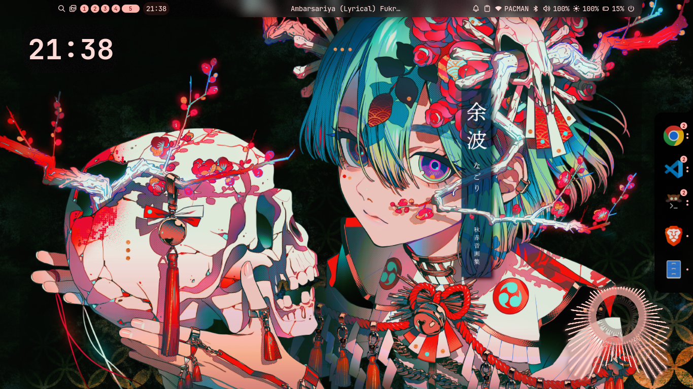
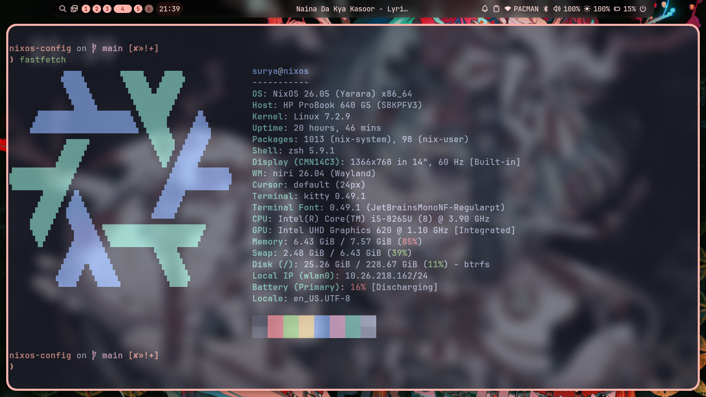

# NixOS Configuration (Niri + Noctalia)


> **⚠️ WARNING:** THIS REPOSITORY IS NOT YET FUNCTIONAL OR MARKED READY TO USE FOR ANYONE. ALTHOUGH IF YOU KNOW WHAT YOU ARE DOING, PLEASE GO AHEAD!

---

## Showcase

Setup showcase, here it is.




---

## 🖥️ Hardware Information

This configuration is specifically tailored for the laptop I am currently using:

| Component | Specification |
| :--- | :--- |
| **CPU** | Intel(R) Core(TM) i5-8265U (8) @ 3.90 GHz |
| **GPU** | Intel UHD Graphics 620 @ 1.10 GHz [Integrated] |
| **RAM** | 8 GB |
| **Storage** | 256 GB SATA SSD |

> **Note on Storage:** I am using a SATA SSD. If you are using an NVMe drive, you might not need some of the specific I/O tuning parameters, but it should generally work fine.
> 
> **Note on GPU:** My system has no Discrete GPU (dGPU), thus I didn't set up any proprietary drivers. You will want to add NVIDIA/AMD drivers to `configuration.nix` if you are using a dGPU.
> 
> **Note on Wi-Fi:** I am using the `iwd` backend for NetworkManager, which is optimized for Intel Wi-Fi cards. You might face issues if you are using a non-Intel network interface.

---

## 🧠 General Philosophy

This configuration is mine, and made for me.

> Without any further explanation, I gently remind anyone who wishes to criticize this configuration:
> 
> * **This configuration is not made for you, neither does it try to be.**
> * **This configuration is slightly or heavily opinionated (or not opinionated at all depending on your perspective). I don't care about that.**
> 
> **Why did I write this config?** To help anyone who wants these things:
> * A beautiful Linux workstation that works and stays out of your way.
> * A foothold in NixOS, which can be a pretty harsh land for beginners.
> * A bridge for anyone who likes the concept of NixOS but is held back by the initial friction.
> * A starting point for those who aren't afraid to do some tinkering if needed, though this config heavily reduces the manual friction you'd normally face.

> NOTE: I ENCOURAGE YOU TO TINKER WITH IT, SEE CONFIGURATION FILES, READ DOCUMENTATIONS AND DO NOT HESITATE TO READ AND FIX SOME ERRORS IF YOU ENCOUNTER.
---


## 🏗️ System Architecture

This laptop is not dual-booting. The setup relies on the **Btrfs** filesystem (though the same logic can be applied to ext4). The system uses default partitioning done by the NixOS graphical installer, which includes an 8 GB swap partition. 

### 1. Tiered Custom Memory Architecture (zram + Physical Swap)
Tis system uses a tiered approach to manage runtime memory:

* **Tier 1: Physical RAM (8GB):** Used for active, foreground processes.
* **Tier 2: zram (Compressed RAM):** The system creates a compressed block device inside the physical RAM. Inactive memory pages are compressed and stored here. This effectively expands usable memory capacity to ~12-16GB at the cost of minimal CPU cycles, completely avoiding the latency of disk I/O.
* **Tier 3: Physical Swap (8GB on SSD):** Acts as a fallback. It is only touched if the zram device fills up, ensuring the system deosn't crashes under heavy load.

> *Note: If you are porting this to a machine with a very weak CPU, you may want to reduce the zram allocation percentage or disable it entirely, as compression requires CPU overhead.*

### 2. Custom Power Management Modules
Achieving **0.5% - 0.8% battery drain per hour** (Testing conditions are explained below), This sytem achieves more than the default `powersave` governor of Power-PRofiles-Daemon. This system uses three tools without conflicting with each other:

* **TLP:** Handles the static baseline. It manages PCIe ASPM, USB autosuspend, Wi-Fi power states, and disk spindown.
* **auto-cpufreq:** Handles active load scaling. It acts as a daemon that monitors CPU load in real-time and dynamically switches between power profiles and frequency scaling, offering much better battery life than the default kernel governors.
* **thermald:** Behaves as the thermal safety net. It monitors thermal zones and proactively adjusts power limits before the hardware hits critical thermal junction temperatures, preventing hard thermal throttling.
* **Sleep States:** When the laptop lid is closed, Niri switch-events and Noctalia handle the sleep/suspend events automatically.

> NOTE: The test was conducted by me on my old hardware with 72% battery health for a duration of 10HRS, WIth approximately 4-5 GB of content in ram. The laptop was on standby mode for the entire duration. 

### 3. Work In Progress / Known Issues
* **Tailscale:** Downloaded and installed, but not yet fully configured or hardened.
* **Firewalls:** The networking firewall rules (`modules/networking_firewalls.nix`) are currently a work in progress and not fully locked down yet.
* **Memory Architecture:** The memory architecture is experimental and has some rough edges.

>> Note: Since i am not dual booting, i am not yet aware of the system complications.
---

## ⚙️ Software Stack

This system uses **Niri** (a scrollable-tiling Wayland compositor) and **Noctalia** as its shell/GUI environment. 
> If you wish to use GNOME or KDE, stick to the graphical NixOS ISO and do not use this configuration aside from getting an overview of NixOS module structures.

---

## 🛠️ Setup & Installation Guide

The system-wide applications are already listed in `configuration.nix`. I use `git` and the GitHub CLI (`gh`) as my version control system.

> **Note:** Initially, `git` is not installed on a fresh NixOS system. Run `nix-shell -p git` to temporarily drop into a shell environment with git installed, and run the following commands inside that shell.

```bash
# 1. Enter a temporary shell with git installed
nix-shell -p git

# 2. Clone the repo in the home directory
git clone https://github.com/Surydevx/nixos-config.git

# 3. Go to the config directory
cd ~/nixos-config

# 4. Take ownership of ALL files and folders (including hidden ones like .git)
sudo chown -R $USER:$(id -gn) .

# 5. Copy your hardware-specific files (MUST be done before moving /etc/nixos!)
sudo cp /etc/nixos/hardware-configuration.nix ~/nixos-config/hardware-configuration.nix

# 6. Backup the default installer configuration files
sudo mv /etc/nixos /etc/nixos.bak

# 7. Add the newly copied hardware-configuration.nix to git tracking
git add hardware-configuration.nix

# 8. Build NixOS
sudo nixos-rebuild switch --flake .#nixos
```

# 9. Post building
Set of instructions you have to do before you can enjoy your system.
```Bash
## Configuring git
git config --file ~/.gitconfig.local user.name "Your Name"
git config --file ~/.gitconfig.local user.email "your.email@example.com"

## conifguring Github CLI
gh auth login
```

> Alternatively you can just go and copy your existing .gitconfig from previous git setup and just copy paste it in .gitconfig.local and please refrain yourself doing same for gh.

## Commiting
```Bash
git commit -m "<Insert Your Commit Message>"
```

## Download and setup wallpapers.

>> By defualt the setup for wallpapers is straightforward
>> whole `~/Pictures` directory is default, so you can drop either standalone png files or folders both works.

```bash
cd Pictures
git clone https://github.com/dharmx/walls
```
💡 Usage & Suggestions
Learn the Keybinds: Press Super + Shift + / to bring up the hotkey overlay and learn how to navigate this new tiling environment.
Make it Yours: Go ahead and configure your system visually using the Noctalia GUI. It will write directly to your Niri config, which remains unlocked for your edits.
